<div align="center">


<p align="center">
  
</p>

<!-- Status Badges -->
<p align="center">
  
  
  
</p>

<!-- Navigation -->
<p align="center">
  <a href="#-overview"></a>
  <a href="#-structure"></a>
  <a href="#-assignments"></a>
  <a href="#-resources"></a>
  <a href="#-contributing"></a>
</p>

</div>

---

<div align="center">

### 🌟 **Welcome to the AISE Weekly Curriculum Repository** 🌟

*Where technology meets justice, and education transforms communities*

</div>

## 📖 Overview

<table>
<tr>
<td>

**AISE (Applied AI Solutions Engineering)** is a comprehensive program designed for advanced programmers with AI experience who want to deepen their expertise. You'll go beyond theory to practice, training with machine learning, advanced Python, and modern development practices—equipping yourself to design, build, and deploy real-world AI-powered solutions.

**Program Overview:**
- 🎯 **Advanced AI Engineering** - Master production-grade ML systems and infrastructure
- 🚀 **Real-World Applications** - Build end-to-end AI solutions from concept to deployment
- 💼 **Career Development** - Develop professional skills, personal brand, and job market readiness
- 🤝 **Collaborative Learning** - Work on open-source projects and team-based challenges
- 🏗️ **Industry-Ready Skills** - Learn modern development practices, CI/CD, and scalable architectures

```mermaid
graph TD
    A[🎓 Education] --> D[💡 Innovation]
    B[⚖️ Justice] --> D
    C[🤝 Community] --> D
    D --> E[🌍 Impact]
    
    style A fill:#3b82f6,stroke:#1e40af,color:#fff
    style B fill:#8b5cf6,stroke:#6d28d9,color:#fff
    style C fill:#10b981,stroke:#047857,color:#fff
    style D fill:#f59e0b,stroke:#d97706,color:#fff
    style E fill:#ef4444,stroke:#dc2626,color:#fff
```

</td>
<td width="300">



</td>
</tr>
</table>

## 🏗️ Repository Structure

<details>
<summary><b>📁 Click to expand repository structure</b></summary>

```text
AISE-Curriculum-Weekly/
│
├── � Phase-01-Orientation/
│   ├── 📝 learning-contract/
│   ├── 🎯 personal-why/
│   ├── 🛠️ platform-setup/
│   └── � progress-tracking/
│
├── 🐍 Phase-02-Foundations/
│   ├── 📝 python-mastery/
│   ├── 🏗️ data-structures/
│   ├── � oop-design/
│   ├── 💼 personal-development/
│   └── 📊 assessments/
│
├── 🏗️ Phase-03-Product-Engineering/
│   ├── 🔧 design-patterns/
│   ├── 🌐 api-development/
│   ├── ⚡ microservices/
│   ├── 🚀 ml-pipeline-project/
│   └── 💼 professional-branding/
│
├── ⚡ Phase-04-Advanced-Infrastructure/
│   ├── ☸️ kubernetes/
│   ├── � distributed-processing/
│   ├── 🌐 advanced-apis/
│   ├── 🎉 hackathon-01/
│   └── � leadership-development/
│
├── 🤖 Phase-05-ML-Engineering/
│   ├── 👁️ computer-vision/
│   ├── 💬 nlp-systems/
│   ├── � multimodal-ai/
│   ├── 🎮 reinforcement-learning/
│   ├── 🤖 automl/
│   └── 🤝 open-source-project/
│
├── 🚀 Phase-06-Production-ML/
│   ├── 🧪 experiment-design/
│   ├── 📈 time-series/
│   ├── 💡 recommendation-systems/
│   ├── 🔍 search-systems/
│   ├── 📊 monitoring/
│   ├── 🎉 hackathon-02/
│   └── � job-market-prep/
│
├── 🧠 Phase-07-Advanced-ML-AI/
│   ├── 🤖 llm-engineering/
│   ├── 🔍 rag-systems/
│   ├── 🤝 ai-agents/
│   ├── 🧬 synthetic-data/
│   ├── ⚖️ ai-governance/
│   └── 💼 internship-prep/
│
├── 🎯 Phase-08-Capstone/
│   ├── 🗄️ database-design/
│   ├── 🔄 ci-cd-pipelines/
│   ├── 📊 monitoring-security/
│   ├── 🎉 hackathon-03/
│   ├── 🎬 mvp-demos/
│   └── 🏆 industry-showcase/
│
├── 🔧 tools/
│   ├── 🐍 python-utils/
│   ├── 📊 ml-frameworks/
│   ├── ☸️ infrastructure-tools/
│   └── 🔄 deployment-scripts/
│
├── 📖 documentation/
│   ├── 🏁 getting-started.md
│   ├── 🎨 style-guide.md
│   ├── 🔍 troubleshooting.md
│   └── 📚 learning-resources.md
│
└── 🌐 community/
    ├── 💬 discussions/
    ├── 🎉 hackathon-showcases/
    ├── 🤝 mentorship/
    └── 💼 career-resources/
```

</details>

## 📝 Program Phases & Curriculum

<div align="center">

### 🎓 **AISE 2026 Program Timeline**

</div>

<table>
<tr>
<td width="50%" valign="top">

#### **📚 Phase Overview**

| Phase | Duration | Focus Area |
|:------|:---------|:-----------|
| **🚀 Orientation** | Sep 22-25 | Foundation & Mindset |
| **� Foundations** | Sep 29 - Oct 19 | Python Mastery & Personal Development |
| **🏗️ Product Engineering** | Oct 20 - Nov 30 | Architecture & ML Pipelines |
| **⚡ Advanced Infrastructure** | Dec 1 - Jan 12 | Production Systems & Leadership |
| **🤖 ML Engineering** | Jan 13 - Feb 11 | Advanced AI & Collaboration |
| **🚀 Production ML** | Feb 12 - Mar 22 | Scaling & Job Market Prep |
| **🧠 Advanced ML/AI** | Mar 23 - Apr 6 | LLMs, RAG & Governance |
| **🎯 Capstone** | Apr 7 - Jul 2 | MVP Development & Showcase |

</td>
<td width="50%" valign="top">

#### **📈 Progress Tracking**


</td>
</tr>
</table>

### 🎯 **Detailed Phase Breakdown**

<details>
<summary><b>🚀 Phase 1: Orientation (September 22-25)</b></summary>

**Foundation Building**
- Program structure introduction
- Development tools and collaboration practices
- Building curiosity and success mindset
- Team formation and communication protocols

**Key Deliverables:**
- Learning contract completion
- Platform setup (Canvas, Slack)
- Personal "Why" reflection

</details>

<details>
<summary><b>🐍 Phase 2: Foundations (September 29 - October 19)</b></summary>

**Python Mastery & Personal Development**
- Core syntax and advanced data structures
- Object-oriented design principles
- Advanced Python features and best practices
- Career path design and self-reflection

**Key Deliverables:**
- Python proficiency assessments
- Personal development plan
- Code quality demonstrations

</details>

<details>
<summary><b>🏗️ Phase 3: Product Engineering (October 20 - November 30)</b></summary>

**Architecture & ML Infrastructure**
- Design patterns and system architecture
- API development and microservices
- Performance optimization techniques
- Personal branding and professional storytelling

**Key Deliverables:**
- **First End-to-End ML Pipeline Project**
- Architecture documentation
- Professional portfolio development

</details>

<details>
<summary><b>⚡ Phase 4: Advanced Infrastructure (December 1 - January 12)</b></summary>

**Production-Grade Systems**
- Kubernetes and container orchestration
- Distributed processing frameworks
- Advanced API development
- Leadership and communication skills

**Key Deliverables:**
- **Hackathon #1 Participation**
- Production system deployment
- Leadership project

</details>

<details>
<summary><b>🤖 Phase 5: ML Engineering (January 13 - February 11)</b></summary>

**Cutting-Edge AI Technologies**
- Computer vision and image processing
- Natural Language Processing (NLP)
- Multi-modal AI systems
- Reinforcement learning and AutoML

**Key Deliverables:**
- **Collaborative Open-Source Mini Project**
- Advanced AI implementation
- Team collaboration assessment

</details>

<details>
<summary><b>🚀 Phase 6: Production ML (February 12 - March 22)</b></summary>

**Scaling & Market Preparation**
- Experiment design and A/B testing
- Time series analysis and forecasting
- Recommendation systems and search
- Mock interviews and job market preparation

**Key Deliverables:**
- **Hackathon #2 Participation**
- Production ML system
- Job search portfolio

</details>

<details>
<summary><b>🧠 Phase 7: Advanced ML/AI (March 23 - April 6)</b></summary>

**Next-Generation AI Systems**
- Large Language Model (LLM) engineering
- Retrieval-Augmented Generation (RAG) systems
- AI agents and autonomous systems
- Synthetic data generation and AI governance

**Key Deliverables:**
- Advanced AI system implementation
- Internship preparation materials
- Change management case study

</details>

<details>
<summary><b>🎯 Phase 8: Capstone (April 7 - July 2)</b></summary>

**Production-Ready MVP Development**
- Database design and data pipelines
- CI/CD implementation and deployment
- Monitoring, security, and maintenance
- Industry panel presentation

**Key Deliverables:**
- **Complete ML MVP with Production Deployment**
- **Hackathon #3 Participation**
- **Industry Panel Showcase**
- Final demo and documentation

</details>

### 📊 **Learning Outcomes by Phase**

<div align="center">
<table>
<tr>
<td align="center" width="25%">

**🎓 Technical Skills**
<br>
<sub>Python, ML, AI, Infrastructure,<br>Production Systems</sub>

</td>
<td align="center" width="25%">

**� Professional Development**
<br>
<sub>Leadership, Communication,<br>Personal Branding</sub>

</td>
<td align="center" width="25%">

**🤝 Collaboration**
<br>
<sub>Team Projects, Open Source,<br>Hackathons</sub>

</td>
<td align="center" width="25%">

**🚀 Career Readiness**
<br>
<sub>Job Search, Interviews,<br>Industry Connections</sub>

</td>
</tr>
</table>
</div>

## 📚 Learning Resources

<div align="center">

### 🎓 **Curated Learning Paths by Phase**

</div>

<table>
<tr>
<td valign="top" width="50%">

#### 🐍 **Phase 2: Python Foundations**
- [Python.org Official Tutorial](https://docs.python.org/3/tutorial/)
- [Real Python - Advanced Topics](https://realpython.com/)
- [Effective Python by Brett Slatkin](https://effectivepython.com/)
- [Python Data Structures & Algorithms](https://runestone.academy/ns/books/published/pythonds/index.html)

#### 🏗️ **Phase 3: Product Engineering**
- [System Design Primer](https://github.com/donnemartin/system-design-primer)
- [Microservices Patterns](https://microservices.io/patterns/)
- [API Design Best Practices](https://swagger.io/resources/articles/best-practices-in-api-design/)
- [Clean Architecture by Robert Martin](https://blog.cleancoder.com/uncle-bob/2012/08/13/the-clean-architecture.html)

#### ⚡ **Phase 4: Infrastructure**
- [Kubernetes Official Documentation](https://kubernetes.io/docs/)
- [Docker Best Practices](https://docs.docker.com/develop/dev-best-practices/)
- [Apache Spark Documentation](https://spark.apache.org/docs/latest/)
- [Distributed Systems for Fun and Profit](http://book.mixu.net/distsys/)

#### 🤖 **Phase 5: ML Engineering**
- [Computer Vision: Algorithms and Applications](http://szeliski.org/Book/)
- [Natural Language Processing with Python](https://www.nltk.org/book/)
- [Hands-On Machine Learning](https://github.com/ageron/handson-ml2)
- [Deep Learning by Ian Goodfellow](https://www.deeplearningbook.org/)

</td>
<td valign="top" width="50%">

#### 🚀 **Phase 6: Production ML**
- [MLOps Engineering at Scale](https://www.oreilly.com/library/view/mlops-engineering-at/9781617298509/)
- [Designing Machine Learning Systems](https://www.oreilly.com/library/view/designing-machine-learning/9781098107956/)
- [Time Series Analysis and Forecasting](https://otexts.com/fpp3/)
- [Recommender Systems Handbook](https://link.springer.com/book/10.1007/978-1-4899-7637-6)

#### 🧠 **Phase 7: Advanced AI**
- [Attention Is All You Need](https://arxiv.org/abs/1706.03762) (Transformer Paper)
- [LangChain Documentation](https://python.langchain.com/docs/get_started/introduction.html)
- [Retrieval-Augmented Generation for AI](https://ai.facebook.com/blog/retrieval-augmented-generation-streamlining-the-creation-of-intelligent-natural-language-processing-models/)
- [AI Agents and Multi-Agent Systems](https://www.multiagent.com/)

#### 🎯 **Phase 8: Capstone**
- [The Lean Startup](http://theleanstartup.com/) - MVP Development
- [CI/CD Pipeline Best Practices](https://www.atlassian.com/continuous-delivery/principles/continuous-integration-vs-delivery-vs-deployment)
- [Monitoring and Observability](https://sre.google/sre-book/monitoring-distributed-systems/)
- [Security in ML Systems](https://github.com/EthicalML/awesome-machine-learning-operations#security)

#### 💼 **Professional Development**
- [Cracking the Coding Interview](https://www.crackingthecodinginterview.com/)
- [System Design Interview by Alex Xu](https://www.amazon.com/System-Design-Interview-insiders-Second/dp/B08CMF2CQF)
- [GitHub Portfolio Building](https://docs.github.com/en/github/setting-up-and-managing-your-github-profile/managing-your-profile-readme)
- [Technical Leadership Skills](https://www.oreilly.com/library/view/the-managers-path/9781491973882/)

</td>
</tr>
</table>

### 🔗 **Essential Tools & Platforms**

<div align="center">
<table>
<tr>
<td align="center" width="25%">

**🛠️ Development**
<br>
[VS Code](https://code.visualstudio.com/) • [PyCharm](https://www.jetbrains.com/pycharm/) • [Jupyter](https://jupyter.org/)

</td>
<td align="center" width="25%">

**☁️ Cloud Platforms**
<br>
[AWS](https://aws.amazon.com/) • [Azure](https://azure.microsoft.com/) • [GCP](https://cloud.google.com/)

</td>
<td align="center" width="25%">

**🤖 ML Frameworks**
<br>
[TensorFlow](https://tensorflow.org/) • [PyTorch](https://pytorch.org/) • [Scikit-learn](https://scikit-learn.org/)

</td>
<td align="center" width="25%">

**📊 Data & Visualization**
<br>
[Pandas](https://pandas.pydata.org/) • [NumPy](https://numpy.org/) • [Matplotlib](https://matplotlib.org/)

</td>
</tr>
</table>
</div>

## 🚀 Getting Started

### 📋 **Pre-Program Onboarding**

<div align="center">

**Before You Start! Complete these essential steps:**

</div>

<table>
<tr>
<td width="33%" align="center">

**📝 Learning Contract**
<br>
<sub>Sign your commitment to the program and understand expectations</sub>

</td>
<td width="33%" align="center">

**💭 Personal "Why"**
<br>
<sub>Reflect on your motivation and goals for the program</sub>

</td>
<td width="33%" align="center">

**�️ Platform Setup**
<br>
<sub>Get familiar with Canvas and Slack</sub>

</td>
</tr>
</table>

<details>
<summary><b>�🔧 Technical Setup Instructions</b></summary>

### Prerequisites
```bash
# Check Python version (3.9+ required)
python --version

# Check Git installation
git --version

# Check Docker installation (for later phases)
docker --version
```

### Installation
```bash
# Clone the repository
git clone https://github.com/StrayDogSyn/AISE-Curriculum-Weekly.git

# Navigate to the directory
cd AISE-Curriculum-Weekly

# Set up virtual environment (recommended)
python -m venv aise-env

# Activate virtual environment
# On Windows:
aise-env\Scripts\activate
# On macOS/Linux:
source aise-env/bin/activate

# Install base dependencies (when available)
pip install -r requirements.txt
```

### Phase-Specific Setup
- **Phase 2-3**: Python development environment
- **Phase 4**: Docker, Kubernetes CLI
- **Phase 5-6**: ML frameworks (TensorFlow, PyTorch)
- **Phase 7**: LLM tools and frameworks
- **Phase 8**: Cloud platform accounts (AWS/Azure/GCP)

</details>

### 🎯 **Success Metrics**

<div align="center">
<table>
<tr>
<td align="center" width="25%">

**📈 Technical Growth**
<br>
<sub>Master advanced AI engineering skills</sub>

</td>
<td align="center" width="25%">

**💼 Career Readiness**
<br>
<sub>Build portfolio and job market skills</sub>

</td>
<td align="center" width="25%">

**🤝 Collaboration**
<br>
<sub>Excel in team projects and hackathons</sub>

</td>
<td align="center" width="25%">

**🚀 Innovation**
<br>
<sub>Create production-ready AI solutions</sub>

</td>
</tr>
</table>
</div>

## 🤝 Contributing

<div align="center">

**We welcome contributions from all community members!**

<p>
  <a href="CONTRIBUTING.md"></a>
  <a href="CODE_OF_CONDUCT.md"></a>
</p>

</div>

### 💡 How to Contribute

1. **🍴 Fork** the repository
2. **🌿 Create** a feature branch (`git checkout -b feature/amazing-feature`)
3. **✨ Commit** your changes (`git commit -m 'Add amazing feature'`)
4. **📤 Push** to the branch (`git push origin feature/amazing-feature`)
5. **🔄 Open** a Pull Request

## 📊 Repository Stats

<div align="center">


</div>

## 🏆 Recognition & Achievements

<div align="center">

### 🌟 **Cohort Achievements**


</div>

## 📬 Contact & Support

<div align="center">

<table>
<tr>
<td align="center">

**🎓 Academic Support**
<br>
For course-related questions

[📧 Email](mailto:academic@aise.org)

</td>
<td align="center">

**🔧 Technical Help**
<br>
For repository issues

[🐛 Issues](https://github.com/StrayDogSyn/AISE-Curriculum-Weekly/issues)

</td>
<td align="center">

**💬 Community**
<br>
Join our discussions

[💭 Discussions](https://github.com/StrayDogSyn/AISE-Curriculum-Weekly/discussions)

</td>
</tr>
</table>

</div>

---

## 📚 Works Cited

### Development Tools & Technologies

**Programming Languages & Frameworks:**
- Python Software Foundation. *Python Programming Language*. Version 3.11+. Python Software Foundation, 2024. [https://www.python.org/](https://www.python.org/)
- Microsoft Corporation. *TypeScript: JavaScript with syntax for types*. Microsoft, 2024. [https://www.typescriptlang.org/](https://www.typescriptlang.org/)
- Meta Platforms, Inc. *React: A JavaScript library for building user interfaces*. Meta, 2024. [https://react.dev/](https://react.dev/)
- Vercel, Inc. *Next.js: The React Framework for Production*. Vercel, 2024. [https://nextjs.org/](https://nextjs.org/)

**AI/ML Libraries & Frameworks:**
- The pandas development team. *pandas: powerful data structures for data analysis, time series, and statistics*. Version 2.0+. NumFOCUS, 2024. [https://pandas.pydata.org/](https://pandas.pydata.org/)
- NumPy Developers. *NumPy: The fundamental package for scientific computing with Python*. NumPy, 2024. [https://numpy.org/](https://numpy.org/)
- Matplotlib Development Team. *Matplotlib: Visualization with Python*. NumFOCUS, 2024. [https://matplotlib.org/](https://matplotlib.org/)
- Scikit-learn Developers. *scikit-learn: Machine Learning in Python*. INRIA, 2024. [https://scikit-learn.org/](https://scikit-learn.org/)
- PyTorch Team. *PyTorch: An open source machine learning framework*. Meta AI, 2024. [https://pytorch.org/](https://pytorch.org/)
- TensorFlow Developers. *TensorFlow: An end-to-end open source platform for machine learning*. Google, 2024. [https://www.tensorflow.org/](https://www.tensorflow.org/)
- Harrison, Chase. *LangChain: Building applications with LLMs through composability*. LangChain, 2024. [https://python.langchain.com/](https://python.langchain.com/)

**Development Environment & Tools:**
- Microsoft Corporation. *Visual Studio Code*. Version 1.90+. Microsoft, 2024. [https://code.visualstudio.com/](https://code.visualstudio.com/)
- GitHub, Inc. *GitHub Copilot: Your AI pair programmer*. GitHub, 2024. [https://github.com/features/copilot](https://github.com/features/copilot)
- Git SCM. *Git: A free and open source distributed version control system*. Software Freedom Conservancy, 2024. [https://git-scm.com/](https://git-scm.com/)
- GitHub, Inc. *GitHub: Where the world builds software*. GitHub, 2024. [https://github.com/](https://github.com/)
- Docker, Inc. *Docker: Accelerated Container Application Development*. Docker, 2024. [https://www.docker.com/](https://www.docker.com/)

**Testing & Quality Assurance:**
- Holger Krekel, et al. *pytest: helps you write better programs*. pytest-dev, 2024. [https://pytest.org/](https://pytest.org/)
- Python Software Foundation. *unittest: Unit testing framework*. Python Software Foundation, 2024. [https://docs.python.org/3/library/unittest.html](https://docs.python.org/3/library/unittest.html)
- David Anson. *markdownlint: A Node.js style checker and lint tool for Markdown/CommonMark files*. GitHub, 2024. [https://github.com/DavidAnson/markdownlint](https://github.com/DavidAnson/markdownlint)
- Street Side Software. *Code Spell Checker: Spelling checker for source code*. Visual Studio Marketplace, 2024. [https://marketplace.visualstudio.com/items?itemName=streetsidesoftware.code-spell-checker](https://marketplace.visualstudio.com/items?itemName=streetsidesoftware.code-spell-checker)

**Documentation & Visualization Tools:**
- John Gruber. *Markdown: A text-to-HTML conversion tool for web writers*. Daring Fireball, 2024. [https://daringfireball.net/projects/markdown/](https://daringfireball.net/projects/markdown/)
- Vercel, Inc. *Capsule Render: Dynamic SVG generator for GitHub profiles*. Vercel, 2024. [https://github.com/kyechan99/capsule-render](https://github.com/kyechan99/capsule-render)
- DenverCoder1. *Readme Typing SVG: Dynamically generated typing animation for your README*. GitHub, 2024. [https://github.com/DenverCoder1/readme-typing-svg](https://github.com/DenverCoder1/readme-typing-svg)
- Shields.io. *Shields.io: Quality metadata badges for open source projects*. Shields.io, 2024. [https://shields.io/](https://shields.io/)

### Educational Resources & Methodologies

**Programming Best Practices:**
- Martin, Robert C. *Clean Code: A Handbook of Agile Software Craftsmanship*. Prentice Hall, 2008.
- Hunt, Andrew, and David Thomas. *The Pragmatic Programmer: Your Journey to Mastery*. 20th Anniversary Edition, Addison-Wesley Professional, 2019.
- McConnell, Steve. *Code Complete: A Practical Handbook of Software Construction*. 2nd Edition, Microsoft Press, 2004.

**AI/ML Engineering:**
- Géron, Aurélien. *Hands-On Machine Learning with Scikit-Learn, Keras, and TensorFlow*. 3rd Edition, O'Reilly Media, 2022.
- Goodfellow, Ian, Yoshua Bengio, and Aaron Courville. *Deep Learning*. MIT Press, 2016.
- Slatkin, Brett. *Effective Python: 90 Specific Ways to Write Better Python*. 2nd Edition, Addison-Wesley Professional, 2019.

**Software Engineering Principles:**
- Fowler, Martin. *Refactoring: Improving the Design of Existing Code*. 2nd Edition, Addison-Wesley Professional, 2018.
- Beck, Kent. *Test Driven Development: By Example*. Addison-Wesley Professional, 2002.
- Evans, Eric. *Domain-Driven Design: Tackling Complexity in the Heart of Software*. Addison-Wesley Professional, 2003.

### Academic & Professional Organizations

**Educational Institutions:**
- Justice Through Code Initiative. *Applied AI Solutions Engineering Program*. Justice Through Code, 2024. [https://www.justicethroughcode.org/](https://www.justicethroughcode.org/)
- The Last Mile. *Community Engagement and Digital Literacy Programs*. The Last Mile, 2024. [https://thelastmile.org/](https://thelastmile.org/)
- The Moth. *Community Storytelling and Public Speaking Programs*. The Moth, 2024. [https://themoth.org/](https://themoth.org/)

**Professional Development:**
- Outlier AI. *AI Content Development and Model Training*. Outlier, 2024. [https://outlier.ai/](https://outlier.ai/)
- MongoDB, Inc. *MongoDB University: AI Agent Development Certification*. MongoDB, 2024. [https://university.mongodb.com/](https://university.mongodb.com/)
- Udemy, Inc. *Professional Development Courses: Full-Stack Development and JavaScript*. Udemy, 2024. [https://www.udemy.com/](https://www.udemy.com/)

### Technical Standards & Documentation

**Python Enhancement Proposals (PEPs):**
- van Rossum, Guido, Barry Warsaw, and Nick Coghlan. *PEP 8 – Style Guide for Python Code*. Python Software Foundation, 2001. [https://peps.python.org/pep-0008/](https://peps.python.org/pep-0008/)
- Goodger, David, and Guido van Rossum. *PEP 257 – Docstring Conventions*. Python Software Foundation, 2001. [https://peps.python.org/pep-0257/](https://peps.python.org/pep-0257/)
- Lehtosalo, Jukka, et al. *PEP 484 – Type Hints*. Python Software Foundation, 2014. [https://peps.python.org/pep-0484/](https://peps.python.org/pep-0484/)

**Web Standards:**
- World Wide Web Consortium (W3C). *HTML Living Standard*. WHATWG, 2024. [https://html.spec.whatwg.org/](https://html.spec.whatwg.org/)
- World Wide Web Consortium (W3C). *CSS Specifications*. W3C, 2024. [https://www.w3.org/Style/CSS/](https://www.w3.org/Style/CSS/)
- Ecma International. *ECMAScript 2024 Language Specification*. Ecma International, 2024. [https://www.ecma-international.org/publications-and-standards/standards/ecma-262/](https://www.ecma-international.org/publications-and-standards/standards/ecma-262/)

### Business & Professional Context

**Company Information:**
- StrayDog Syndications LLC. *Applied AI Solutions and Digital Innovation*. StrayDog Syndications LLC, 2024. [https://www.straydog-syndications-llc.com/](https://www.straydog-syndications-llc.com/)
- StrayDog Syndications LLC. *Technology Division: AI Engineering Services*. StrayDog Syndications LLC, 2024. [https://www.straydogsyndicationsllc.tech/](https://www.straydogsyndicationsllc.tech/)

**Professional Profiles:**
- Petross, Eric 'Hunter'. *LinkedIn Professional Profile*. LinkedIn Corporation, 2024. [https://www.linkedin.com/in/eric-petross-766a08330](https://www.linkedin.com/in/eric-petross-766a08330)
- StrayDogSyn. *GitHub Professional Portfolio*. GitHub, Inc., 2024. [https://github.com/StrayDogSyn](https://github.com/StrayDogSyn)
- StrayDogSyn. *Hugging Face AI Model Hub Profile*. Hugging Face, Inc., 2024. [https://huggingface.co/StrayDogSyn](https://huggingface.co/StrayDogSyn)

---

<div align="center">

### 📖 **Citation Style**

*This Works Cited section follows a hybrid format combining MLA 9th Edition guidelines with technical documentation standards appropriate for software engineering and AI development projects. All tools, technologies, and resources have been properly attributed to respect intellectual property and open-source contributions.*

**Last Updated:** September 29, 2025  
**Document Version:** 1.0  
**Author:** Eric 'Hunter' Petross (@StrayDogSyn)

</div>

---

<div align="center">

### 💝 **Built with ❤️ by the AISE Community**

<p>
  
  
  
</p>

**© 2024 AISE Initiative | Licensed under [The Unlicense](LICENSE)**


</div> 
